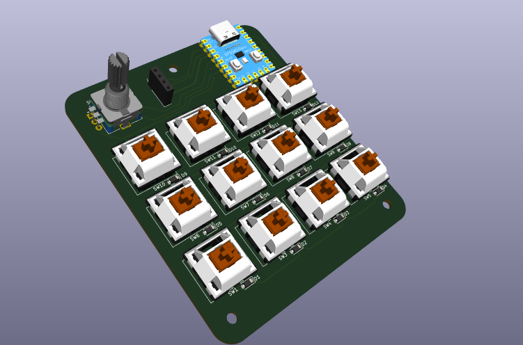
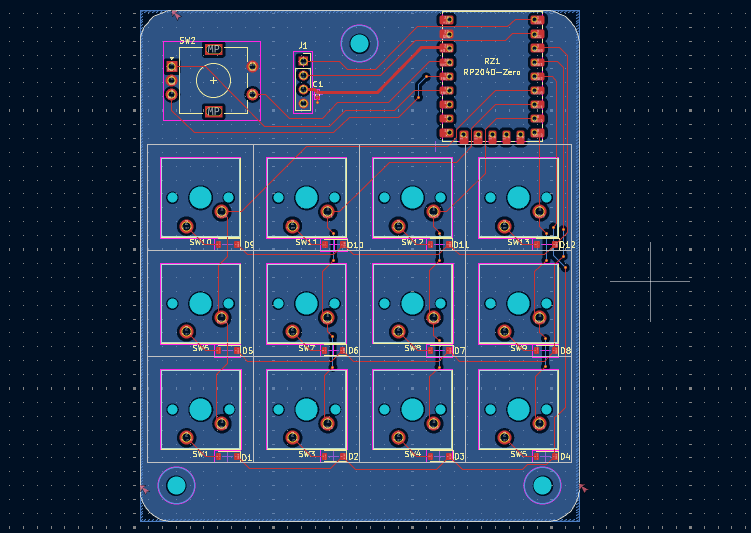
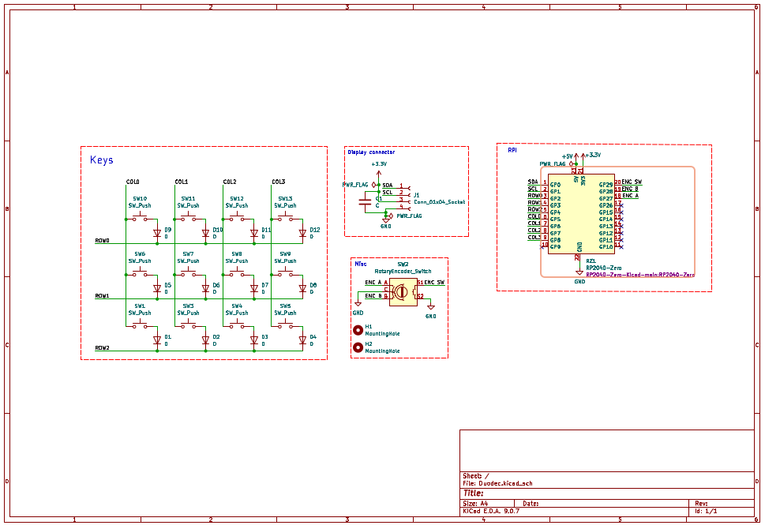

# Duodec

A 12-key + 1 rotary encoder macropad built on
the RP2040-Zero, designed for developers and
students who live in their terminal.

---

## Overview

**Duodec** (Latin: _twelve_) is a compact, open-source macropad featuring 12 mechanical switches, a clickable rotary encoder, and an 128x32 OLED display. Built around the RP2040-Zero, it's fully programmable in Python.

Designed as a productivity tool for VS Code, terminal workflows, and what not!

---

## Features

- 12x mechanical key switches in a 4×3 matrix
- 1x EC11 rotary encoder with push-button click
- 128×32 OLED display
- RP2040-Zero (RP2040 chip, USB-C)
- Fully programmable in Python
- Multiple layers for different workflows
- SMD diodes (SOD-123) for key matrix
- Custom 3D printed case
- Open source hardware and software
