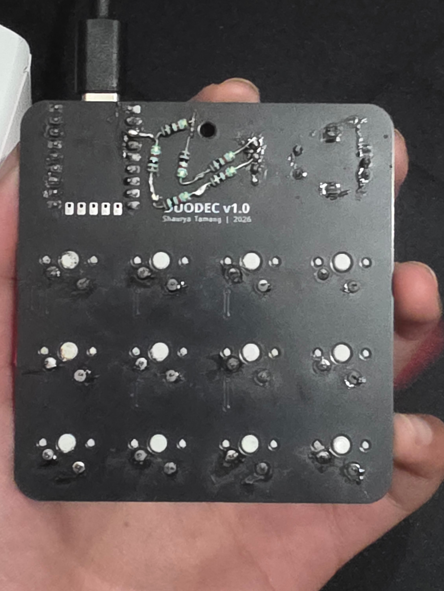

# Duodec

A 12-key + 1 rotary encoder macropad built on
the RP2040-Zero, designed for developers and
students who live in their terminal.

---

## Overview

**Duodec** (Latin: _twelve_) is a compact, open-source macropad featuring 12 mechanical switches, a clickable rotary encoder, and an 128x32 OLED display. Built around the RP2040-Zero, it's fully programmable in Python.

---

## Working Demo

Here’s a quick demonstration of Duodec in action, showing key inputs, encoder rotation, and OLED layer switching.

---

## Features

- 12x mechanical key switches in a 4x3 matrix
- 1x rotary encoder with push-button click
- 128x32 OLED display
- RP2040-Zero (RP2040 chip, USB-C)
- Fully programmable in Python
- Multiple layers for different workflows
- Custom 3D printed keys
- Open source hardware and software

## ⚠️ Important Wiring Note
Sorry about this ;-; but the OLED display requires **2-4kΩ 3.3V pull-up resistors** on both:
- SDA (I2C data line)
- SCL (I2C clock line)

Without these, the display will not function at all.

## Customization

1. Clone this repository
2. Open `src/main.py`
3. Modify keymaps (line 26)
4. Add your own shortcuts and layers
5. Flash to your RP2040-Zero

Be productive 🚀

## Contributing

Contributions are welcome!

If you'd like to improve Duodec, you can:
- Suggest new features or workflows
- Improve firmware or add new layers
- Fix bugs or optimize performance
- Enhance documentation or visuals

Please open an issue first to discuss major changes.

Pull requests should be clean, well-documented, and tested where possible.